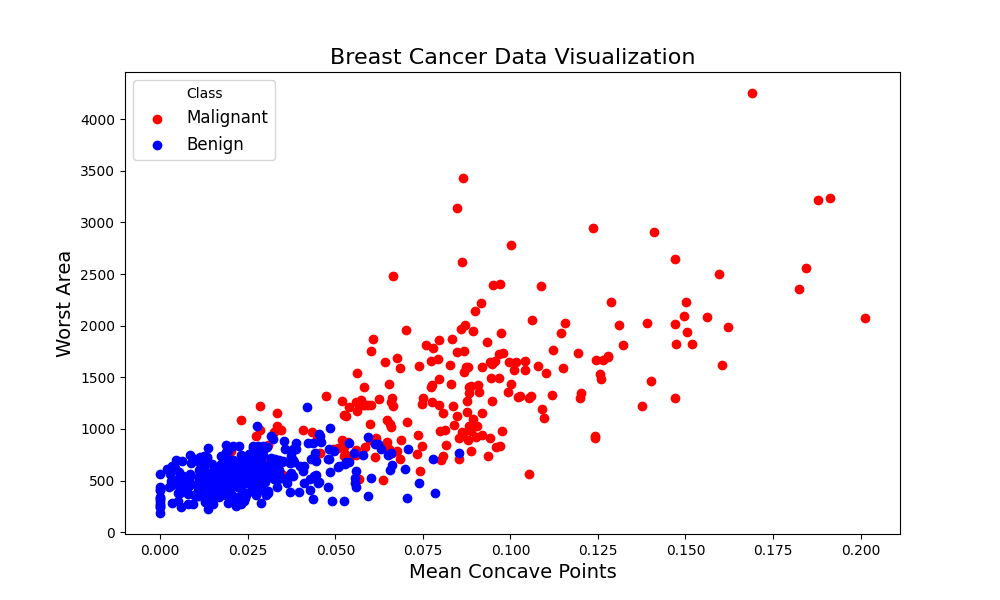
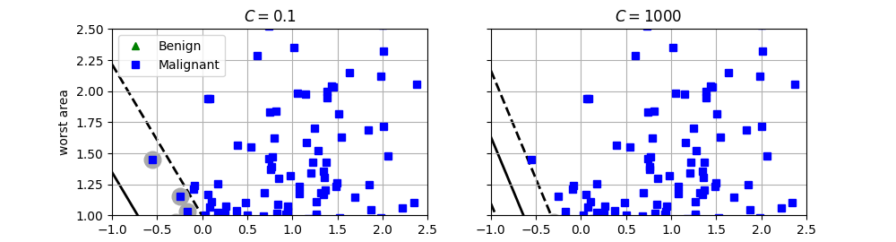
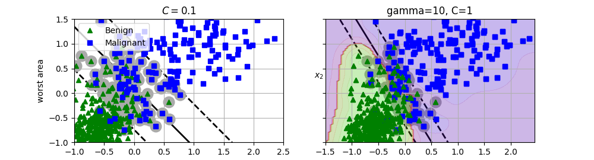

# Breast Cancer Classification with SVM

Binary classification of breast tumors (**Malignant** vs **Benign**) using Support Vector Machines, applied to the scikit-learn `load_breast_cancer` dataset. The project explores how the **regularization parameter C**, the **kernel choice** (linear vs RBF), and **hyperparameter tuning** affect the decision boundary and model performance.

## How to Run (Docker)

```bash
docker build -t svm_project .
docker run --rm -v "${PWD}:/app/svm_project" svm_project
```

This generates the plots below into the `screenshots/` folder in this repo.

## Dataset

- Source: `sklearn.datasets.load_breast_cancer`
- Features used: `worst area`, `mean concave points` (2D for visualization purposes)
- Target: `0 = Malignant`, `1 = Benign`

## 1. Data Visualization

The two selected features are plotted against each other, colored by class, to check separability before modeling.



Malignant tumors tend to have higher `worst area` and higher `mean concave points`, showing a reasonably separable structure between the two classes.

## 2. Linear SVM — Effect of C

Two `LinearSVC` models were trained with different regularization strengths:

| Model | C | Behavior |
|---|---|---|
| `svm_clf1` | 0.1 | Wider margin, more tolerant of misclassifications |
| `svm_clf2` | 1000 | Narrower margin, fits training data more tightly |

**Steps:**
1. Features scaled with `StandardScaler`.
2. Models trained inside a `Pipeline`.
3. Coefficients rescaled back to the original (unscaled) feature space for interpretability.
4. Decision boundary + margins plotted with a custom `plot_svc_decision_boundary` function.



**Observation:** Lower `C` (0.1) produces a larger margin, allowing more points inside/near the margin (more regularization → higher bias, lower variance). Higher `C` (1000) tightens the margin around the training points (lower bias, higher variance risk of overfitting).

## 3. Support Vectors

Support vector counts for the `SVC(kernel="linear")` equivalents:

| Model | C | # Support Vectors |
|---|---|---|
| `svm_clf1` | 0.1 | 118 |
| `svm_clf2` | 1000 | 62 |

Fewer support vectors at high `C` confirms a tighter, less regularized boundary.

## 4. Model Evaluation — F1 Score

| Model | C | F1 Score |
|---|---|---|
| `svm_clf1` | 0.1 | 0.944 |
| `svm_clf2` | 1000 | 0.951 |

Both linear models perform well; the higher-`C` model scores marginally better on training data, though this alone doesn't guarantee better generalization.

## 5. Hyperparameter Tuning — RBF Kernel (GridSearchCV)

A non-linear `SVC(kernel="rbf")` was tuned over:

```python
param_grid = {
    'C': [0.1, 1, 10, 100],
    'gamma': [0.1, 1, 10, 100]
}
```

**Best result (5-fold CV, scoring = F1):**

| Metric | Value |
|---|---|
| Best `C` | 1 |
| Best `gamma` | 10 |
| Best CV F1 score | 0.9465 |
| Support vectors | 197 |

## 6. Decision Boundary (RBF Kernel)

The tuned RBF model (`C=1, gamma=10`) was visualized on the scaled feature space.



**Observation:** The RBF boundary captures a non-linear separation between classes. It correctly separates most points, but some misclassifications remain — a few benign points fall in the "malignant" region and vice versa, indicating natural overlap between the two classes on these two features alone.

## Tech Stack

- `numpy`, `matplotlib`
- `scikit-learn`: `SVC`, `LinearSVC`, `StandardScaler`, `Pipeline`, `GridSearchCV`, `f1_score`

## Key Takeaways

- **C controls the bias-variance tradeoff** in SVMs: small C → wider margin/more regularization; large C → tighter fit.
- **Feature scaling is essential** for SVMs since they are distance-based.
- **RBF kernels** capture non-linear boundaries that linear SVMs cannot, at the cost of more hyperparameters to tune (`C`, `gamma`).
- **GridSearchCV** with cross-validation is an effective way to systematically find good hyperparameters rather than guessing.

## Author

Giorgos Makropoulos